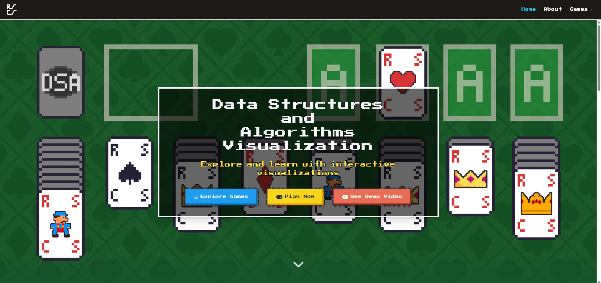

# DSA Project
TRY IT OUT HERE: 
https://rs-cs.vercel.app/

## Prerequisites (Download)
- [Node.js](https://nodejs.org/en/download/prebuilt-installer)

## Recomended VSCode Extensions (for devs)
- Tailwind CSS IntelliSense
- Auto Rename Tag
- GitLens
- Material Icon Theme
- Tailwind Shades
- Unused CSS Classes for Javascript/Angular/React

## Credits and Attributions
- [Car Assets](https://minzinn.itch.io/pixelvehicles) by Minzinn under [CC BY 4.0](https://creativecommons.org/licenses/by/4.0/).  
- [Gamepad UI / Controller Assets](https://greatdocbrown.itch.io/gamepad-ui) by greatdocbrown are in the public domain (CC0 1.0).  
- About Page Assets and Music from Stardew Valley by ConcernedApe
- Mario and Pokemon Franchise Assets and Music by Nintendo 
- Streetfighter Assets by CAPCOM

## Screenshots 
<div align="center">
  <table>
    <tr>
      <td></td>
      <td></td>
      <td></td>
    </tr>
    <tr>
      <td></td>
      <td></td>
      <td></td>
    </tr>
  </table>
</div>

## Installation

To install the necessary packages, open the command prompt/bash in the root folder and run the following command:

```bash
cd data-structures-vis-project
npm install
```

## Running the Project

Then to start the project, use the following command:

```bash
cd data-structures-vis-project
npm run dev
```

## Contributing

We welcome contributions! Follow these steps to contribute:

1. Clone the repository:

    ```bash
    https://github.com/JoshuaHM-p4/data-structures-vis-project.git
    ```

2. Create a new branch for your feature or bugfix:

    ```bash
    git checkout -b feature-branch-name
    ```

3. Stage your changes
    ```bash
    git add .
    ```

4. Make your changes and commit them:

    ```bash
    git commit -m "Description of your changes"
    ```

5. Push your changes to your forked repository:

    ```bash
    git push origin feature-branch-name
    ```

6. Open a pull request to the main repository.

Thank you for contributing!
